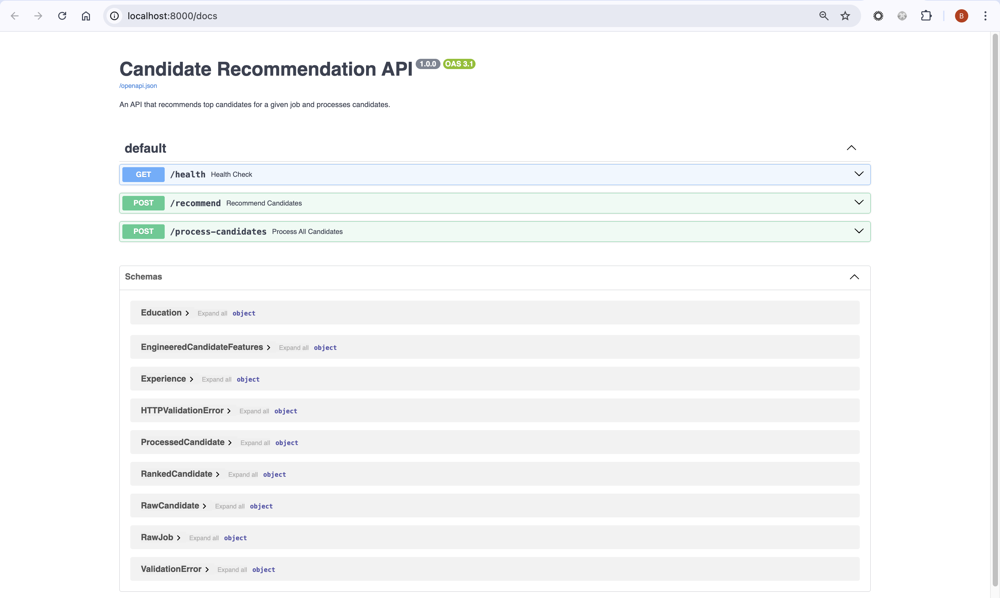

# 🧠 Manatal Recommendation Engine

This project is an **AI-powered recommendation engine** for matching job descriptions with top candidates.  
It combines **LLMs for feature engineering**, **hybrid search (semantic + keyword)**, and a **Streamlit webapp** for interactive exploration.

---

## ⚡ Features

- Manage **raw candidates** and **raw jobs** (`app/data/` as JSON)
- **LLM-driven feature engineering**:
  - infer skills, seniority, summaries for candidates
  - extract skills, experience level, and normalized descriptions for jobs
- **Semantic + rule-based search**:
  - Keyword Search: candidates are filtered on hard criteria (skills, years)
  - Vector Search: then ranked by vector similarity
- **Streamlit dashboard** for interactive browsing and search
- **FastAPI backend** for programmatic access
- For scaling **Chroma vector store** 
---

## 🛠️ Setup

### 1. Clone & install
This project uses [Poetry](https://python-poetry.org/) for dependency management.  
With [direnv](https://direnv.net/) configured, run:

```bash
direnv reload
```

This will install all dependencies from pyproject.toml

### 2. Environment
Make sure the `.env` file contains a valid `MISTRAL_API_KEY` 


### 3. Start APIs & UI

- UI: Streamlit
- API: FastAPI Backend

```bash
docker compose up --build 
```

Then visit:
- Swagger docs: http://localhost:8000/docs 
- Health check: http://localhost:8000/health


Endpoints:
- POST /process-candidates → processes raw candidates into embeddings
- POST /recommend → returns ranked candidates for a job

## 📊 Data Format
### Raw Candidate (app/data/raw_candidates.json)
```
{
  "id": 1,
  "first_name": "Olivia",
  "last_name": "Chen",
  "email": "olivia.chen@example.com",
  "skills": ["Python", "Docker", "AWS"],
  "experiences": [
    {"company": "NextGen", "role": "Engineer", "start_date": "2014-07-01", "end_date": "2017-09-30", "description": "Worked on APIs"}
  ],
  "education": [
    {"institution": "Stanford", "degree": "M.S. CS", "year_of_graduation": 2014, "description": "Specialized in AI"}
  ]
}
```

### Raw Job (app/data/raw_jobs.json)
```
{
  "job_title": "Software Engineer",
  "company_name": "Tech Corp",
  "location": "San Francisco, CA",
  "job_description": "Build and maintain software applications...",
  "required_skills": ["Python", "JavaScript"],
  "budget": {}
}
```


## 🚀 Roadmap


	•	Add persistent Chroma vector store for faster search
	•	Support streaming LLM APIs for live feature generation
	•	Authentication & role-based access to API
	•	CI/CD pipeline for deployment
